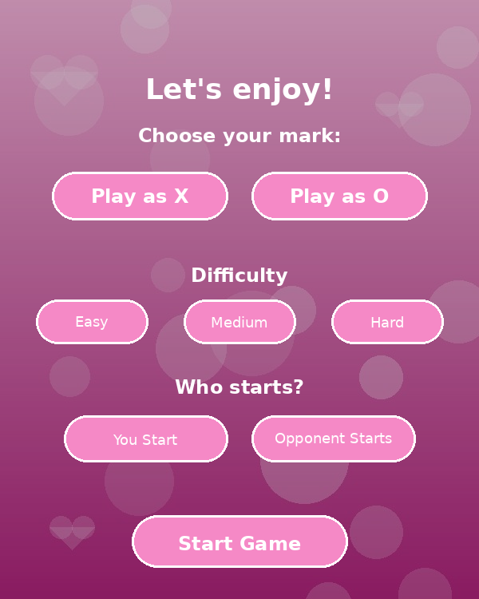
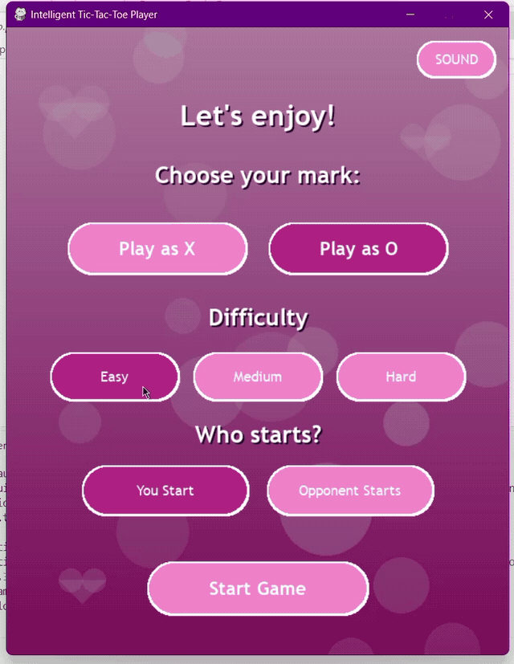
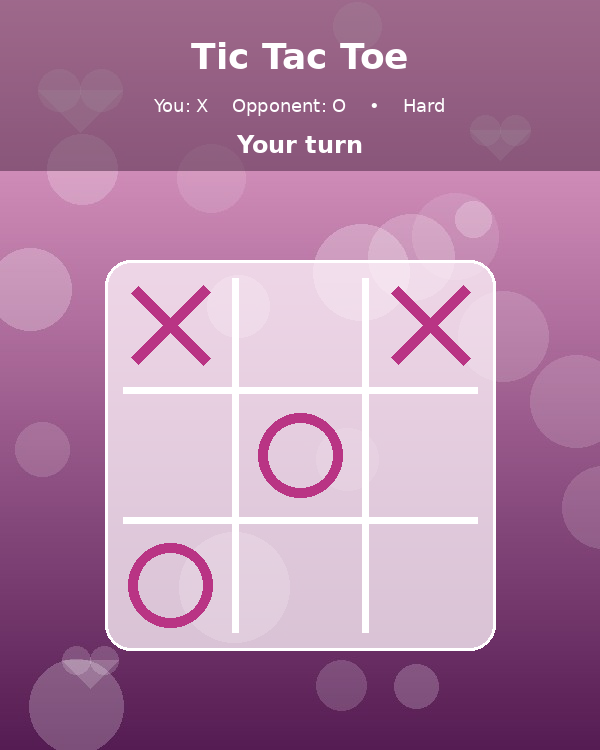

# Intelligent-TicTacToe-Player

<p align="center">
  <strong>An intelligent Tic-Tac-Toe game built with Python and Pygame, powered by Minimax, Alpha-Beta Pruning, and heuristic-based decision making.</strong>
</p>

<p align="center">
  
</p>

---

## Overview

**Intelligent-TicTacToe-Player** is a desktop Tic-Tac-Toe game developed using **Python** and **Pygame**. The project focuses on classic game AI techniques and adversarial search rather than machine learning.

The computer opponent evaluates possible game states using **Minimax**, improves search efficiency with **Alpha-Beta Pruning**, and uses custom heuristics to create multiple difficulty levels.

The player can choose:

- X or O
- Who starts the match
- Easy, Medium, or Hard difficulty
- Sound on/off

---

## Gameplay Demo

<p align="center">
  
</p>
---

## Features

- Interactive desktop interface built with **Pygame**
- Play as **X** or **O**
- Choose whether **you** or the **computer opponent** starts
- Three difficulty levels
- Minimax-based decision making
- Alpha-Beta Pruning optimization
- Custom heuristic evaluation
- Tactical win detection
- Tactical threat blocking
- Automatic game-over detection
- Win, loss, and draw result screens
- Play Again / End Game flow
- Optional sound effects and background audio

---

## Difficulty Levels

### Easy
Designed to give the player a strong advantage. The computer intentionally makes weaker decisions and may miss opportunities to block the player.

### Medium
Uses tactical checks and a limited-depth search. The computer can recognize immediate winning moves and block common threats while still remaining beatable.

### Hard
Uses full-depth **Minimax with Alpha-Beta Pruning** to choose optimal moves.

Because Tic-Tac-Toe is a solved game, a perfect player cannot always be forced to lose. Against perfect play, the best possible outcome may be a draw.

---

## How the AI Works

The game uses **adversarial search** to evaluate possible future board states.

### Minimax

Minimax assumes that both players try to make the best possible move.

- The computer tries to **maximize** its score.
- The human player is treated as the **minimizing** player.
- The algorithm recursively explores future game states until it reaches a terminal state or a configured search depth.

### Alpha-Beta Pruning

Alpha-Beta Pruning reduces the number of branches Minimax needs to evaluate.

It skips branches that cannot improve the final decision, making the search more efficient **without changing the optimal result**.

### Heuristic Evaluation

For limited-depth searches, a heuristic function estimates the quality of a board state using factors such as:

- Winning opportunities
- Immediate threats
- Center control
- Corner control
- Open lines
- Blocking potential

---

## Screenshots

### Game Setup

<p align="center">
  
</p>

### Gameplay

<p align="center">
  
</p>

### Match Result

<p align="center">
  
</p>

---

## Tech Stack

- **Python**
- **Pygame**
- **Minimax Algorithm**
- **Alpha-Beta Pruning**
- **Heuristic Search**
- **Adversarial Search**

---

## Project Structure

```text
Intelligent-TicTacToe-Player/
|
|-- app.py
|-- ai_logic.py
|-- requirements.txt
|-- README.md
|-- LICENSE.md
|-- .gitignore
|-- START_GAME.bat
|-- BUILD_EXE.bat
|
|-- assets/
|   |-- home_bg.jpg
|   |-- game_bg.jpg
|   |-- result_bg.jpg
|   `-- end_bg.jpg
|
`-- media/
    |-- setup.png
    |-- gameplay.png
    `-- result.png
```

### Main Files

**`app.py`**  
Handles the graphical interface, game states, buttons, rendering, user input, timing, sound, and screen transitions.

**`ai_logic.py`**  
Contains the board logic, winner detection, available moves, heuristic evaluation, Minimax search, and Alpha-Beta Pruning.

---

## Getting Started

### Requirements

- Python **3.12 or 3.13** recommended
- Pygame **2.6+**

### 1. Clone the repository

```bash
git clone https://github.com/mariamzohny/Intelligent-TicTacToe-Player.git
cd Intelligent-TicTacToe-Player
```

### 2. Install dependencies

```bash
python -m pip install -r requirements.txt
```

On Windows with Python 3.12:

```bash
py -3.12 -m pip install -r requirements.txt
```

### 3. Run the game

```bash
python app.py
```

Or on Windows:

```bash
py -3.12 app.py
```

You can also run:

```text
START_GAME.bat
```

---

## Build a Windows Executable

The repository includes `BUILD_EXE.bat` for creating a Windows executable using PyInstaller.

Run:

```text
BUILD_EXE.bat
```

---

## What I Learned

This project was built to practice and demonstrate:

- Game-tree search
- Recursive algorithms
- Adversarial decision making
- Search optimization
- Heuristic design
- Event-driven programming with Pygame
- GUI state management
- Separation of interface and game logic

---

## Future Improvements

- Score history across multiple matches
- Animated transitions
- Additional themes
- Player statistics
- Adjustable AI search depth
- More sound and visual effects
- Online multiplayer mode

---

## Author

**mariamzohny**

Developed as a Python game-AI project demonstrating **Minimax**, **Alpha-Beta Pruning**, and heuristic search.

If you found the project useful, feel free to star the repository.

---

## Usage & Copyright

This repository is made publicly available for portfolio, educational, and demonstration purposes only.

You are welcome to review the code and learn from it. However, you may not:

- Copy or redistribute the project.
- Re-upload or republish the source code.
- Sell or commercially exploit the project.
- Submit the project as your own academic or professional work.
- Remove attribution and claim authorship.

Any reuse beyond personal learning requires explicit permission from the author.

**All rights reserved.**
